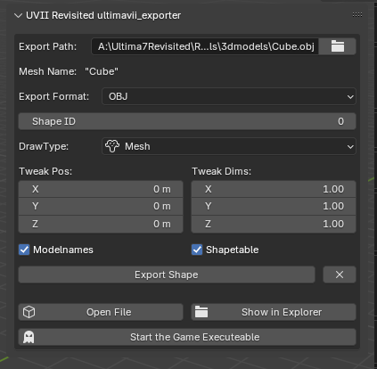

# Ultima VII Revisited Blender Exporter
This project aims to ease the export of mesh objects into the [Ultima VII: Revisited](https://github.com/ViridianGames/U7Revisited) project.

- **Export Name:** This shows the filename formatted from the data according to the standards set out by ViridianGames.
- **Export Format:** OBJ or GLTF. At the moment only OBJ is supported.
- **Shape ID:** The number of the shape. The engine references that.
- **Frame Number:** The frame number. (Shapes can have multiple frames, which represent animation, variants, etc.)
- **DrawType:** Leave this at mesh.
- **Tweak Pos/Tweak Dims:** Use this to change the relative offset/scale
- **Rotation**: Sets the ingame z-rotation
- **Shapetable:** Write shape data into `shapetable.dat` file. Necessary to see the object in game.
- **Copy the texture:** If this is activated, the texture will be copied to the path of the exported model 
- **Reset Transformations:** Resets any transformation before export - Useful when multiple asset are within one Blender file.
- **Export Shape:** Exports the object to the models folder and adjusts necessary data files (like the shapetable).
- **X:** Delete asset data.
- **Open File:** Opens the exported model file in the default model viewing app.
- **Show in Explorer:** Opens a file browser with the file (Windows only atm).
- **Pack Asset to Zip:** Packs all data into one simple Zip-File for uploading to the U7R discord.
- **Start the Game Executeable:** Starts the game.

## Tutorial

